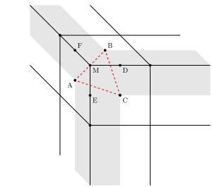

# 漫谈Cubemap插值

Cubemap 是一种常见的表示球面信息的数据结构。因为球面和正方体表面是同胚的，所以用正方体的6个面存储球面上的数据也是自然而然的想法。Cube的每个面正方形的2D纹理，根据球面上的方向向量$(x,y,z)$，可以很容易确定它落在哪个面上（face index），以及对应的2D纹理坐标 $(u,v)$，从而获取对应的颜色。

以上描述看上去合情合理，然而其中埋藏了很多细节上的问题。例如，2D纹理上每个像素点记录的数值为像素中心位置的采样值，如果采样位置落在了边界一圈像素中心点之外又该怎么计算呢？

如上图截取了 Cubemap 的一个角，$A,B,C$ 三个点对应三个面上角落的像素位置，位于图中灰色阴影区域的地方无法仅根据单个面内部的像素颜色插值得到，需要结合相邻面的像素。这里讨论几种可能的结合方式。

#### 拉伸

类似 2D 纹理的 clamp to edge 模式，只用到一个面的像素，哪个方向上出界了就用边界的颜色，相当于把边界往外平移了半个像素宽度，会明显看出瑕疵。

#### 八面体映射

可以将每个面的 2D 纹理往外扩充一圈，扩充的部分填上对应的邻接面上的像素。这样大部分的边界像素都能找到双线性插值的邻居。而只在角上无法确定邻居关系。例如对 $A$ 面做扩充，$A$ 向上走的邻居是 $B$，向右的邻居是 $C$，但是右上的邻居就不好定义了。

换个思路，对于落在空间三角形 $ABC$ 内的采样方向 $\mathbf{d}$，可以直接用 $\mathbf{d}$ 在 $ABC$ 上的重心坐标来插值。

结合上面边和角的两种情况，相当于将立方体先削去8个角，再削去12条棱，用剩余的形状（见下图）与采样方向求交，根据交点在面上、棱上或是角上分别使用双线性插值或是重心坐标插值。

如果削去的部分足够大，剩下的几何体的6个正方形面退化成一个点，则这个几何体就是正八面体。

#### 球面三角形重心坐标插值

Cubemap 每个面的 texel 对应球面上的一点，所以在插值时使用球面矩形/三角形面积关系计算双线性/重心坐标插值是更准确的做法。尤其是在相邻 texel 之间的距离很大的时候更为明显。
[前文]({})已经介绍了球面三角形/多边形面积的计算方法，简单替换面积公式即可。

#### 扩展的双线性插值

Cubemap 每个面往外扩充一个像素能解决除角上的大部分情况。我们可以假设相邻面的交界出也有一系列的采样点，其值就是两个邻接像素的平均值，如上图的 $D,E,F$ 三点。而三个面的交界处（角点）上也有一个采样点，$M$，其值为三个邻接像素的平均值。这些假想的采样点正好把出界的区域分割到不同的矩形里，无论射线方向交在哪个区域，都能找到一个的矩形做双线性插值，并且保证值连续。

#### demo

下面的[demo](./demo.html)演示了不同插值策略的对比，Cubemap每个面仅有1个像素。
在极端的情况下可以看清楚各种插值策略（nearest/spherical barycentric/octahedron/bilinear extended）的效果，并且可与硬件实现的效果（reference）进行比较。

<iframe id="frame" width="100%" height="300" src="./demo.html" style="border: none;"></iframe>

