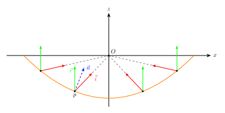
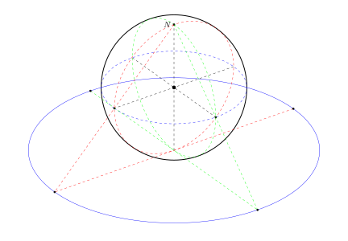

# 双抛物面映射与球极投影等价

### 双抛物面映射

在三维图形渲染中，经常需要用到球面数据。球面数据最常用的表示形式是cubemap。为了捕获cubemap，需要为它的每个面都渲染一遍场景，draw call数量将会暴增。有没有一种方法可以只用2个draw call就捕获球面呢？

最简单的想法，对于渲染的一个点，算出其相对于捕获相机的方向，将它投射到球面上，直接取球面坐标的(x,y)分量。相当于从遥远的太空中看地球的南北极。这种叫做orthographic（正射投影）。可以想象，在赤道附近的球面与视线接近平行，投影的图像被严重挤压。

双抛物面映射（dual paraboloid mapping，在某些语境下也叫做双曲面映射）是另一个将球面投影到平面的方法，一些主流游戏，如 [GTA V](https://www.adriancourreges.com/blog/2015/11/02/gta-v-graphics-study/) 和 [巅峰极速](http://www.gamelook.com.cn/2022/04/480744/) 用它作为env mapping捕获的方案。

坐标变换的推导如下：假设有一抛物面，主轴在z轴，焦点在原点，现由焦点向z-半球面的各个方向上发射光线，经过抛物面的反射之后，反射光总是会平行于z轴。各反射光打到xy平面的点就是双抛物面映射的投影点。

假设有一个球面方向$\vec{i}=(x_i,y_i,z_i), z_i\le0, |\vec{i}|=1$, 如何求出投影到平面上的 uv 坐标呢？不妨设抛物面方程为 $f(x,y)=\frac{1}{2}(x^2+y^2)-\frac{1}{2}$, 如此一来原点就是焦点。抛物面上任意一点的坐标为 $p=(u,v,f(u,v))$, 该点上的两个切线方向为
$$\vec{T}_u = \frac{\partial p}{\partial u} = (1,0,u),\ \ \vec{T}_v= \frac{\partial p}{\partial v} = (0,1,v) .$$
所以$p$点的法线方向为 $\vec{n}=\vec{T}_u\times \vec{T}_v = (u,v,-1)$.
另一方面，对于任意入射方向 $\vec{i}$, 其反射方向都是 $\vec{r}=(0,0,1)$, $\vec{i}$ 和 $\vec{r}$ 都是单位向量，为了满足入射反射关系，$-\vec{i}$与$\vec{r}$相加的结果应该与$\vec{n}$共线，即
$$-(x_i,y_i,z_i)+(0,0,1) = m(u,v,-1)$$
于是得到
$$u = \frac{x_i}{1-z_i},  v = \frac{y_i}{1-z_i};  u,v\in[-1,1].$$

### 球极投影

假设有一个单位球面，球心在原点，北极上有一盏灯，我们希望求出南半球上的一点$(x,y,z)$ 在 $z=-1$ 平面上的投影坐标 $(u,v,-1)$. 根据 $(u,v,-1), (x,y,z), (0,0,1)$ 三点共线，得 $$ \frac{u}{x} = \frac{v}{y} = \frac{2}{1-z} ,$$
所以$$u = \frac{2x}{1-z}, v = \frac{2y}{1-z};\ \ u,v\in [-2,2].$$
如果将“成像平面”从$z=-1$挪到$z=0$，则有
$$u = \frac{x}{1-z}, v = \frac{y}{1-z}; \ \ u,v\in [-1,1].$$
与双抛物面映射完全一致。

### Bonus

假设灯的位置不一定在北极，而在z轴上任意位置$(0,0,h)$，“成像平面”仍然在z=0，由 $(u,v,0), (x,y,z), (0,0,h)$三点共线，可得
$$u = \frac{xh}{h-z}, v = \frac{yh}{h-z}, $$
当 $h\to+\infty$ 时，$u=x, v=y$ 实际上就变成了正射投影。与直观相符。

### 参考文献
- PowerVR: [Dual Paraboloid Environment Mapping Whitepaper](./Dual-Paraboloid-Environment-Mapping.Whitepaper.pdf)

