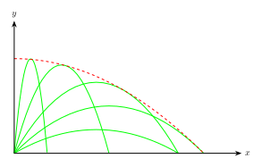
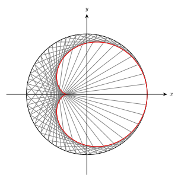
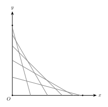
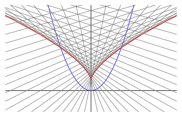

# 曲线族包络线问题的通解

## 序

笔者在近二十余年来遇到了一些求包络线的问题, 每个问题都可以用完全不同的思路解, 同时也存在通用的解法, 在此记录.

## 定速抛体

一个喷泉有一个小的半球形喷嘴, 位于水池中水的表面. 喷嘴上由很多均匀分布的小洞, 通过这些小洞, 水以相同的速度向不同的方向喷出. 求喷泉形成的水钟的形状.



设水的初速度为 $v_0$, 与地面夹角为 $\theta$, 重力加速度为 $g$. 其轨迹的参数方程为:
$$
\begin{align*}
x &= v\_0\cos\theta\cdot t \tag{1}\\\ 
y &= v\_0\sin\theta\cdot t - \frac{1}{2}gt^2 \tag{2} 
\end{align*}
$$
将 (1) 式代入 (2) 式可得轨迹的标准方程为:
$$ y = \tan\theta\cdot x - \frac{g}{2v_0^2\cos^2\theta}\cdot x^2 $$

给定 $x_0$, 遍历所有的 $\theta$, 找到最大的 $y_0$, 则 $(x_0,y_0)$ 就是包络线上的点, 即:
$$ y_0 = \mathop{\max}_{\theta}\\left\\{ \tan\theta\cdot x_0 - \frac{g}{2v_0^2\cos^2\theta}\cdot x_0^2 \\right\\} . $$
令 $\dfrac{\mathrm{d}y}{\mathrm{d}\theta} = 0$, 解得 $\tan\theta = \dfrac{v_0^2}{gx_0}$. 代入求得 $y_0 = -\dfrac{gx_0^2}{2v_0^2} + \dfrac{v_0^2}{2g}$.
所以包络线方程为
$$ y = -\frac{g}{2v_0^2}\cdot x^2 + \frac{v_0^2}{2g} .$$
是一个对称轴在 $y$ 轴上的抛物线.




令 $(x, y)$ 是包络线上一点, 则一定存在一个抛物线 $C_\theta$ 经过该点, 并且包络线和抛物线在该点处的切线相同. 根据抛物线约束关系得:
$$ y = \tan\theta\cdot x - \frac{g}{2v_0^2\cos^2\theta}\cdot x^2 \tag{1} $$
根据切线斜率关系可得
$$ \frac{\mathrm{d}y}{\mathrm{d}x} = \tan\theta - \frac{gx}{v_0^2\cos^2\theta} \tag{2} $$

对 (1) 式求全微分:
$$ \mathrm{d}y = \frac{x\ \mathrm{d}\theta}{\cos^2\theta} + \tan\theta\ \mathrm{d}x - \frac{gx\ \mathrm{d}x}{v_0^2\cos^2\theta} - \frac{gx^2\tan\theta\ \mathrm{d}\theta}{v_0^2\cos^2\theta} \tag{3} $$
将 (2) 式代入 (3) 式可得 
$$ x = \frac{v_0^2}{g\tan\theta} ,$$
再将这个结果代入 (1) 式, 消去 $\theta$, 可得包络线得标准方程为:
$$ y = \frac{v_0^2}{2g} - \frac{g}{2v_0^2} \cdot x^2 $$



## 心脏线

圆周上均匀分布了 $N$ 个点, 连接第 1 个点与第 2 个点, 第 2 个点与第 4 个点, ..., 第 $k$ 个点与第 $2k$ 个点, 等等. 求与这些弦均相切的曲线方程.



曲线上任一点一定位于某条弦上, 设这条弦为 $l_t$, 它的两个端点为 $(\cos t, \sin t)$ 和 $(\cos 2t, \sin 2t)$. 因此斜率为
$$ \frac{\mathrm{d}y}{\mathrm{d}x} = \frac{\sin 2t - \sin t}{\cos 2t - \cos t} = -\frac{\cos\frac{3}{2}t}{\sin\frac{3}{2}t} \tag{1}$$
而弦的方程为
$$ x(\sin 2t - \sin t) - y(\cos 2t - \cos t) = \sin t \tag{2} $$
对 (2) 应用和差化积得
$$ x\cdot\cos\frac{3}{2}t + y\cdot\sin\frac{3}{2}t = \cos\frac{1}{2}t \tag{3} $$
对 (3) 求全微分:
$$ \mathrm{d}x\cdot\cos\frac{3}{2}t -\frac{3x}{2}\cdot\sin\frac{3}{2}t\cdot \mathrm{d}t + \mathrm{d}y\cdot\sin\frac{3}{2}t + \frac{3y}{2}\cos\frac{3}{2}t\cdot \mathrm{d}t = -\frac{1}{2}\sin\frac{1}{2}t\cdot\mathrm{d}t $$
将 (1) 代入得
$$ x\cdot\sin\frac{3}{2}t - y\cdot\cos\frac{3}{2}t = \frac{1}{3}\sin\frac{1}{2}t \tag{4} $$
根据 $(3)\times \cos\dfrac{3}{2}t+(4)\times \sin\dfrac{3}{2}t$, $(3)\times \sin\dfrac{3}{2}t-(4)\times \cos\dfrac{3}{2}t$, 分别可得:
$$
\begin{align*}
x &= \cos\frac{1}{2}t\cdot\cos\frac{3}{2}t + \frac{1}{3}\sin\frac{1}{2}t\cdot\sin\frac{3}{2}t = \frac{1}{3}\cos 2t + \frac{2}{3}\cos t \\\ 
y &= \cos\frac{1}{2}t\cdot\sin\frac{3}{2}t - \frac{1}{3}\sin\frac{1}{2}t\cdot\cos\frac{3}{2}t = \frac{1}{3}\sin 2t + \frac{2}{3}\sin t
\end{align*}
$$





设某条弦 $l_{\alpha}$ 的两端点为 $(\cos\alpha,\sin\alpha)$ 和 $(\cos 2\alpha, \sin 2\alpha)$. 这条弦对应的直线方程为
$$ x(\sin 2\alpha - \sin\alpha) - y(\cos 2\alpha - \cos\alpha) = \sin\alpha ,$$
应用和差化积得到
$$ x\cdot\cos\frac{3}{2}\alpha + y\cdot\sin\frac{3}{2}\alpha = \cos\frac{1}{2}\alpha  \tag{5} $$
与它相邻的弦 $l_{\beta}$ 的两端点为 $(\cos\beta,\sin\beta)$ 和 $(\cos 2\beta, \sin 2\beta)$, 对应的直线方程为
$$ x\cdot\cos\frac{3}{2}\beta + y\cdot\sin\frac{3}{2}\beta = \cos\frac{1}{2}\beta  \tag{6} $$
这里 $\beta - \alpha = \Delta\alpha \to 0$. 

两条弦的交点就是包络线上的点. 联立 (5), (6) 两式, 可解出交点的坐标为
$$
\begin{align*}
x&= \left( \sin\frac{3}{2}\beta\cos\frac{1}{2}\alpha - \sin\frac{3}{2}\alpha\cos\frac{1}{2}\beta \right)\cdot\mathrm{det}^{-1} \\\ 
y&= \left( -\cos\frac{3}{2}\beta\cos\frac{1}{2}\alpha + \cos\frac{3}{2}\alpha\cos\frac{1}{2}\beta \right)\cdot\mathrm{det}^{-1}
\end{align*}
$$
其中 
$$\mathrm{det} = \cos\frac{3}{2}\alpha\cdot\sin\frac{3}{2}\beta - \cos\frac{3}{2}\beta\cdot\sin\frac{3}{2}\alpha = \sin\frac{3(\beta-\alpha)}{2} = \sin\frac{3\Delta\alpha}{2} .$$
将 $\beta = \alpha + \Delta\alpha$ 代入交点坐标的表达式, 展开, 并用等价无穷小替换, 可得
$$
\begin{align*}
x &= \frac{1}{3}\cos 2\alpha + \frac{2}{3}\cos\alpha \\\ 
y &= \frac{1}{3}\sin 2\alpha + \frac{2}{3}\sin\alpha
\end{align*}
$$


## 墙角滑倒的棍子

一根棍子靠在垂直于地面的墙上, 一端在地面上沿直线向外滑动, 另一端始终贴着墙向下滑动, 求棍子运动轨迹构成的形状.



设棍子长为 $1$, 与地面夹角为 $\theta$, 那么棍子两端点坐标为 $(0,\sin\theta)$ 和 $(\cos\theta,0)$, 对应的直线方程为 
$$ \frac{x}{\cos\theta} + \frac{y}{\sin\theta} = 1 .$$
或写成
$$ y = \sin\theta - \tan\theta\cdot x .$$
其中 $\theta\in[0,\dfrac{\pi}{2}]$. 对于给定的 $x_0$, 遍历所有的 $\theta$, 找到最大的 $y_0$, 则 $(x_0, y_0)$ 就是包络线上的点:
$$ y_0 = \mathop{\max}\_{\theta}\\left\\{ \sin\theta - \tan\theta\cdot x\_0 \\right\\} $$

容易求出当 $\cos^3\theta = x_0$ 时, $y'(\theta) = 0$, $y''(\theta) < 0$, 上式取得最大值. 此时 
$$ y_0 = \sin\theta - \tan\theta\cdot\cos^3\theta = \sin^3\theta.$$

于是可得包络线的参数方程:
$$ x = \cos^3\theta, \qquad y = \sin^3\theta .$$
或者写成
$$x^{\frac{2}{3}} + y^{\frac{2}{3}} = 1.$$





假设$(x,y)$是曲线的一点，那么它一定在某一时刻位于棍子上，设此时棍子与地面夹角为$\theta\in[0,\dfrac{\pi}{2}]$，则$(x,y)$满足棍子的直线方程约束
$$ \frac{x}{\cos\theta} + \frac{y}{\sin\theta} = 1 ,$$
或写成
$$ \tan\theta\cdot x + y = \sin\theta \tag{1} $$
曲线上每一点的切线对应棍子的某一时刻的状态, 即:
$$
\frac{\mathrm{d}y}{\mathrm{d}x}= -\tan\theta \tag{2}
$$
将它代入上面的式子得微分方程:
$$-x y' +y=\sqrt{\frac{(y')^2}{(y')^2+1}} $$
这样的形式不是很好求解. 还是从直线方程入手. 对 (1) 式求全微分:
$$  \frac{x}{\cos^2\theta}\ \mathrm{d}\theta + \tan\theta\ \mathrm{d}x + \mathrm{d}y  = \cos\theta\ \mathrm{d}\theta  $$
由 (2) 式可得 
$$ \mathrm{d}y = -\tan\theta\ \mathrm{d}x ,$$
代入上式可得
$$ x = \cos^3\theta ,$$
代回 (1) 式得
$$ y = \sin^3\theta .$$
这就是包络线的参数方程.



## 抛物线的法线

过抛物线 $y = x^2$ 上每一点作法线, 求与这些法线都相切的曲线方程.



抛物线取上一点$(t,t^2)$, 抛物线的切线斜率为 $2t$, 法线斜率为 $-\dfrac{1}{2t}$, 于是法线方程为
$$ y = t^2 + \frac{1}{2} - \frac{x}{2t} \tag{1} $$
所求曲线上的点要满足上述方程, 并且曲线在该点上的切线斜率也是 $-\dfrac{1}{2t}$, 即
$$ \frac{\mathrm{d}y}{\mathrm{d}x} = -\frac{1}{2t} \tag{2} $$
对 (1) 求全微分:
$$ \mathrm{d}y = 2t\ \mathrm{d}t - \frac{\mathrm{d}x}{2t} + \frac{x}{2t^2}\mathrm{d}t $$
然后将 (2) 式代入得:
$$ x = -4t^3 $$
再根据 (1) 可得
$$ y = \frac{1}{2} + 3t^2 $$
这便是所求曲线的参数方程.





抛物线取上一点$(t,t^2)$, 抛物线的切线斜率为 $2t$, 法线斜率为 $-\dfrac{1}{2t}$, 于是法线方程为
$$ y = t^2 + \frac{1}{2} - \frac{x}{2t} \tag{3} $$
所求曲线上的点要满足上述方程, 并且曲线在该点上的切线斜率也是 $-\dfrac{1}{2t}$, 即
$$ y' = -\frac{1}{2t} \tag{4} $$
利用 (4) 式将 (3) 式中的 $t$ 消去, 可得曲线满足的微分方程:
$$ y = \frac{1}{4(y')^2}+xy'+\frac{1}{2} \tag{5} $$
这是一个 Clairaut's Differential Equation, 对方程两边求 $x$ 的导数:
$$ y' = -\frac{y''}{2y'^3} + y' + xy''$$
再令 $y'=p$, 得
$$ -\frac{p'}{2p^3}+xp' = 0 $$
因为 $p'$ 不恒为 $0$, 两边可以约去 $p'$, 得 $p = (2x)^{-\frac{1}{3}} = y'$, 进而代入 (5) 可得所求曲线方程为
$$ y = \frac{3}{2\sqrt[3]{2}}x^{\frac{2}{3}} +  \frac{1}{2} $$



## 通解

假设有一族曲线 $F(x,y,t)=0$, 其中 $t$ 为参数, 如何求与这一族曲线都相切的曲线方程.

考虑曲线族的其中两条曲线 $F(x,y,t)=0$ 和 $F(x,y,t+\Delta t)=0$. 联立这两个曲线方程, 求出它们的交点:
$$
\begin{align*}
F(x,y,t) &= 0 \tag{1} \\\ 
F(x,y,t+\Delta t) &= 0 \tag{2}
\end{align*}
$$
当 $\Delta t\to 0$ 时, 
$$ F(x,y,t+\Delta t) = F(x,y,t) + F'_t(x,y,t)\Delta t  \tag{3} $$ 
代入 (2), 并根据 (1) 得
$$ F'_t(x,y,t) = 0 \tag{4} $$
再联立 (1), (4) 两个方程可以解出交点坐标 $(X_t, Y_t)$.

既然 $(X_t, Y_t)$ 位于曲线 $F(x,y,t)=0$ 上, 那么可以求出该点处切线斜率. 固定 $t$, 变化 $x,y$, 使 $(X_t+\Delta x, Y_t + \Delta y)$ 仍然位于 $F(x,y,t)=0$ 上, 令 $\Delta x, \Delta y\to 0$, 则
$$ F(X_t,Y_t,t) + F'_x(X_t,Y_t,t)\Delta x + F'_y(X_t,Y_t,t)\Delta y = 0 .$$
将 $F(X_t,Y_t,t)=0$ 代入, 得切线斜率为
$$ \frac{\Delta y}{\Delta x} = -\frac{ F'_x(X_t,Y_t,t)}{ F'_y(X_t,Y_t,t)}  \tag{5}$$

另一方面, 当 $t$ 变化时, 交点坐标 $(X_t, Y_t)$ 也构成一条曲线. 当 $t$ 变化到 $t+\Delta t$ 时, $(X_t, Y_t)$ 的变化量为 
$$ \Delta X_t = X_{t+\Delta t} - X_t, \qquad \Delta Y_t =Y_{t+\Delta t} - Y_t .$$
$(X_t+\Delta X_t, Y_t+\Delta Y_t)$ 同样满足方程 (1): 
$$ F(X_t+\Delta X_t, Y_t+\Delta Y_t, t+\Delta t) = 0 \tag{6} $$
再令 $\Delta t \to 0$, 有 $\Delta X_t, \Delta Y_t\to 0$, 再根据 $F(X_t,Y_t,t)=0$ 可得
$$ F'_x(X_t, Y_t, t) \Delta X_t + F'_y(X_t, Y_t, t) \Delta Y_t +  F'_t(X_t, Y_t, t)\Delta t = 0.$$
而 $(X_t,Y_t)$ 同时也满足 (4), 于是
$$\frac{\Delta Y_t}{\Delta X_t} = -\frac{ F'_x(X_t,Y_t,t)}{ F'_y(X_t,Y_t,t)} \tag{7} $$

可见参数为 $t$ 的曲线 $(X_t, Y_t)$ 的切线斜率与 $F(x,y,t)=0$ 在 $(X_t, Y_t)$ 处的切线斜率一样, 故它们相切. 因此所求的曲线方程就是对于不同的参数 $t$ 满足 (1) 和 (4) 的点构成的曲线.

特别地, 若曲线族 $F(x,y,t)=0$ 具有 $y=f(x,t)$ 的形式, 则 $F(x,y,t)=f(x,t)-y$, 根据
$$ F'_t(x,y,t) = f'_t(x,t) = 0 $$
可直接解出 $x$ 与 $t$ 的关系, 进而再根据 (1) 可以求出 $y$ 与 $t$ 的关系.

