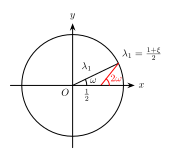

# 多边形的Laplacian平滑

多年以前在微博上看到一个[优美的结论](https://weibo.com/5097174964/IDKXgdi0t)，但是没有解释背后的原理。最近又看到了，有了一些思路，在此给出推导过程。



画个随机多边形，连接各条边的中点，形成新的多边形，不断重复这一过程，最后会收敛成一个椭圆。



下面的[demo](./demo.html)展示了这个过程。

<iframe id="frame" width="100%" height="300" src="./demo.html" style="border: none;"></iframe>

我想到了两个推导方法，本质上是一样的。



### 从矩阵特征值求解
设原多边形有 $n$ 个顶点, 坐标分别是 $(x_0,y_0), (x_1,y_1), \cdots, (x_{n-1},y_{n-1})$. 仅考虑 $x$ 坐标, 设 $x_k$ 经过 $t$ 步迭代变成了 $x_k^{(t)}$, 则有如下关系:
$$ \\begin{bmatrix} x_0^{(t+1)}\\\\x_1^{(t+1)}\\\\ \vdots \\\\x_{n-2}^{(t+1)} \\\\x_{n-1}^{(t+1)} 
\\end{bmatrix} =  \frac{1}{2} \\begin{bmatrix} 1 & 1 & 0 & \cdots & 0 & 1 \\\\ 0 & 1 & 1 & \cdots & 0 & 0 \\\\ & & & \ddots & & \\\\ 0 & 0 & 0 & \cdots & 1 & 1 \\\\ 1 & 0 & 0 & \cdots & 0 & 1\\end{bmatrix} \\begin{bmatrix} x_0^{(t)}\\\\x_1^{(t)}\\\\ \vdots \\\\ x_{n-2}^{(t)} \\\\ x_{n-1}^{(t)} \\end{bmatrix} $$
记变换矩阵为 $M$, 并记
$$ \bold{x}^{(t)} =  [x_0^{(t)},x_1^{(t)},\cdots,x_{n-1}^{(t)}]^\mathrm{T} ,$$
则 
$$ \bold{x}^{(t)} = M^t \bold{x}^{(0)} .$$
对 $M$ 进行特征值分解, 特征方程为
$$ \\begin{vmatrix} \dfrac{1}{2} - \lambda & \dfrac{1}{2} & 0 & \cdots & 0 & 0 \\\\ 0 & \dfrac{1}{2} - \lambda & \dfrac{1}{2} & \cdots & 0 & 0 \\\\ & & & \ddots & & \\\\ 0 & 0 & 0 & \cdots & \dfrac{1}{2} - \lambda & \dfrac{1}{2} \\\\ \dfrac{1}{2} & 0 & 0 & \cdots & 0 & \dfrac{1}{2} - \lambda \\end{vmatrix} = 0.$$
依次将第 $k$ 行乘以 $\dfrac{1}{(2\lambda-1)^k}$ 加到最后一行, 可以化简为
$$ (\lambda - \frac{1}{2})^n = \frac{1}{2} ,$$
于是特征值为 $\lambda_k = \dfrac{1+\xi^k}{2}$, $0\le k\le n-1$. 这里 $\xi$ 为 $n$ 次单位根: $\xi = e^{\frac{2\pi i}{n}}$. $\lambda_k$ 对应的特征向量为
$$ \bold{u}_k = [1, \xi^k, \xi^{2k}, \cdots, \xi^{(n-1)k}]^\mathrm{T} .$$
对 $M$ 进行对角化得 $M = P^{-1}\Lambda P$, 其中 $\Lambda = \mathrm{diag}(\lambda_0,\cdots,\lambda_{n-1})$, $P$ 的第 $k$ 列是 $\bold{u}_k$, 它是一个特殊的范德蒙矩阵, 并且不难验证
$$P^{-1} = \\begin{bmatrix} 1 & 1 & \cdots & 1 \\\\ 1 & \xi & \cdots & \xi^{n-1} \\\\ 1 & \xi^2  & \cdots & \xi^{2(n-1)} \\\\ \vdots & \vdots & \ddots & \vdots \\\\ 1 & \xi^{n-1} & \cdots & \xi^{(n-1)(n-1)} \\end{bmatrix} ^{-1} = \frac{1}{n} \\begin{bmatrix} 1 & 1 & \cdots & 1 \\\\ 1 & \xi^{-1} & \cdots & \xi^{-(n-1)} \\\\ 1 & \xi^{-2}  & \cdots & \xi^{-2(n-1)} \\\\ \vdots & \vdots & \ddots & \vdots \\\\ 1 & \xi^{-(n-1)} & \cdots & \xi^{-(n-1)(n-1)} \\end{bmatrix}  $$
只要注意到 $\xi^{-k} = \xi^{n-k}$ 以及当 $1\le k\le n-1$ 时有 $1+\xi^k+\xi^{2k}+\cdots+\xi^{(n-1)k}=0$ 即可. 后者成立是因为 $\xi^k$ 满足 
$$(\xi^k-1)(1+\xi^k+\xi^{2k}+\cdots+\xi^{(n-1)k}) = \xi^{nk}-1 = 0 .$$
进一步, 因为 $\xi^{-1} = \bar{\xi}$, 所以矩阵 $P$ 和 $nP^{-1}$ 不仅都是对称矩阵, 而且对应的行(列)互为共轭.
有了对角化结果, $ \bold{x}^{(t)}$ 的解析表达式可以直接求出: 
$$
\begin{aligned} 
\bold{x}^{(t)} &= P^{-1}\cdot\Lambda^t\cdot P\cdot \bold{x}^{(0)} \\\ 
 &=  \frac{1}{n}[\bar{\bold{u}}_0,\cdots,\bar{\bold{u}}_{n-1}] \cdot \Lambda^t\cdot [\bold{u}_0^\mathrm{T},\cdots,\bold{u}_{n-1}^\mathrm{T}]^\mathrm{T}\cdot  \bold{x}^{(0)} \\\ 
&= \frac{1}{n}[\lambda_0^t\bar{\bold{u}}_0,\cdots,\lambda_{n-1}^t\bar{\bold{u}}_{n-1}]\cdot[\bold{u}_0^\mathrm{T},\cdots,\bold{u}_{n-1}^\mathrm{T}]^\mathrm{T} \cdot \bold{x}^{(0)} \\\ 
&= \frac{1}{n}\\left(\sum_{k=0}^{n-1}{\lambda_k^t\bar{\bold{u}}_k\cdot\bold{u}_k^\mathrm{T} }\\right)\bold{x}^{(0)}
\end{aligned}
$$
这里每个 $\bar{\bold{u}}_k\cdot\bold{u}_k^\mathrm{T}$ 都是一个矩阵. 
当 $t\to\infty$ 时, 求和式中除了 $k=0$ 一项以外其余的 $\lambda_k^t$都趋于 $0$, $\bar{\bold{u}}_0\cdot\bold{u}_0^\mathrm{T}$ 为全 $1$ 的矩阵, 而 $\lambda_0=1$, 表明最终每个点的 $x$ 坐标都会收敛到所有点 $x$ 坐标的均值.

再考虑绝对值第二大的特征值 $\lambda_1$ 和 $\lambda_{n-1}$, 这两项决定了收敛过程的主要细节. 两个矩阵的第 $p$ 行第 $q$ 列元素分别为( $p$, $q$ 从 $0$ 开始):
$$
\begin{aligned}
\left[\lambda_1^t\bar{\bold{u}}_1\bold{u}_1^\mathrm{T}\right]_{p,q} &= \lambda_1^t\xi^{q-p} \\\ 
\left[\lambda_{n-1}^t\bar{\bold{u}}_{n-1}\bold{u}_{n-1}^\mathrm{T}\right]_{p,q} &= \bar{\lambda}_1^t\xi^{p-q} = \overline{\lambda_1^t\xi^{q-p}}
\end{aligned}
$$
而对于$\lambda_1$, 它的辐角 $\omega$ 和模长 $r$ 都可以求出来: 
$$\lambda_1 = r\cdot e^{i\omega} = \cos(\dfrac{\pi}{n})\cdot e^{\frac{i\pi}{n}}.$$ 

综上, 设所有点的 $x$ 坐标均值为 $X$, 则 $\bold{x}^{(t)}$ 第 $k$ 个元素偏离均值的量为
$$
\begin{aligned}
x_k^{(t)} - X &= \sum_{q=0}^{n-1}{ (\lambda_1^t\xi^{q-k} + \overline{\lambda_1^t\xi^{q-k}}) x_q } = \sum_{q=1}^{n-1}2\cdot\mathrm{Re}(\lambda_1^t\xi^{q-k} x_q) \\\ 
&= 2\cdot\mathrm{Re}\left(\sum_{q=1}^{n-1}\lambda_1^t\xi^{q-k} x_q\right) = 2\cdot\mathrm{Re}\left(\lambda_1^t\sum_{q=1}^{n-1}\xi^{q-k} x_q\right) \\\ 
&= 2r^t\cdot\mathrm{Re}\left( e^{i\omega t}\cdot\xi^{-k}\cdot\sum_{q=0}^{n-1}\xi^{q}x_q \right) 
\end{aligned}
$$
求和式内的复数与 $t$ 无关, 给定初始点坐标, 求和式的值其实也就确定了, 它其实就是对所有 $x$ 坐标进行离散傅里叶逆变换的第一项. 记求和式的值为 $\displaystyle \sum_{q=0}^{n-1}\xi^{q}x_q = r_x \cdot e^{i\phi_x}$, 则
$$ 
\begin{aligned}
x_k^{(t)} - X & = 2r^t\mathrm{Re}\\left( r_x \cdot e^{i(\phi_x+\omega t-\frac{2k\pi}{n})}\\right) \\\ 
 & = 2r^t\cdot r_x\cos(\phi_x+\omega t-\frac{2k\pi}{n}).
\end{aligned}
$$

类似的, 对于 $y$ 坐标, 也有如下关系:
$$ y_k^{(t)} - Y = 2r^t\cdot r_y\cos(\phi_y+\omega t-\frac{2k\pi}{n}).$$
可见每个点 $(x_k, y_k)$ 在迭代过程中围绕中心坐标 $(X,Y)$ 在 $x$ 和 $y$ 方向上分别做阻尼震荡, 振幅和相位由所有点的初始位置决定. 随着 $t$ 变化, $(x_k, y_k)$ 的运动轨迹是一条螺线, 如果不考虑半径的变化, 运动轨迹就是一个椭圆. 参数方程已由上面的式子给出.

### 离散傅里叶变换

还可以从卷积的角度考虑这个问题. 两个离散序列 $\bold{a}=\{a_i\}, \bold{b}=\{b_i\}$ 之间的卷积运算定义为:
$$ 
\left[\bold{a}*\bold{b}\right]\_k = \sum_{j=-\infty}^{+\infty} {a_j\cdot b_{k-j}} .
$$

若令 
$$\bold{b}^{(t)}=[x_0^{(t)}, \cdots, x_{n-1}^{(t)}], \qquad \bold{a}=\left[\dfrac{1}{2}, 0, \cdots, 0, \dfrac{1}{2}\right], $$
则 
$$
\begin{aligned}
\bold{a}*\bold{b}^{(t)} &= [ \frac{1}{2} (x_0^{(t)} + x_1^{(t)}), \cdots, \frac{1}{2} (x_{n-1}^{(t)} + x_0^{(t)}) ] \\\ 
&= [x_0^{(t+1)}, \cdots, x_{n-1}^{(t+1)}] \\\ 
&= \bold{b}^{(t+1)} 
\end{aligned}
$$

迭代一次相当于用卷积核 $\bold{a}$ 作用于原序列. 又因为时(空)域的卷积对应于频域的乘积, 所以可以利用离散傅里叶变换(DFT)来计算任意次迭代之后的结果.

记序列 $\bold{a}, \bold{b}$ 的离散傅里叶变换分别为花体的 $\mathcal{A}, \mathcal{B}$, 则
$$
\begin{aligned}
\mathcal{A}\_k &= \sum_{j=0}^{n-1}{a_j \xi^{-kj}} = \frac{1}{2}(1+\xi^k) = r_k \cdot e^{i\omega_k} \\\ 
\mathcal{B}\_k &= \sum_{j=0}^{n-1}{b_j \xi^{-kj}}
\end{aligned}
$$
其中 $\xi = e^{\frac{2\pi i}{n}}$ 依然是 $n$ 次单位根, $r_k=\cos(\omega_k)$, $\omega_k=\dfrac{k\pi}{n}$. 将 $\mathcal{A}$ 的每个元素自乘 $t$ 次, 就得到将序列 $\bold{a}$ 进行 $t$ 次卷积后的 DFT 结果:
$$ \mathcal{A}_k^t =  r_k^t\cdot e^{i\omega_kt} $$
将序列 $\mathcal{A}^t \mathcal{B}$ 进行离散傅里叶逆变换, 即可得到 $ \bold{b}^{(t)} = \bold{a}*\bold{a}*\cdots *\bold{b}$ 的结果:
$$
[\bold{b}^{(t)}]_k = \frac{1}{n}\sum_{j=0}^{n-1}{ \mathcal{A}_j^t\mathcal{B}_j\xi^{jk} } = \frac{1}{n}\sum_{j=0}^{n-1}{ r_j^t \cdot e^{i\omega_j (t+2k)} \cdot B_j } 
$$
观察 $t\to\infty$ 时, 求和式的每一项. 当 $j>0$ 时, $r_j < 1$, $r_j^t\to 0$, 而 $r_0 = 1$, $\omega_0=0$, $\mathcal{B}_0$ 就是 $\bold{b}$ 的各项之和. 说明 $\bold{b}^{(t)}$ 的每一项都会收敛于原来序列的均值.
$j=1$ 和 $j=n-1$ 所对应的 $r_j$ 是第二大的, 又容易证明 $\mathcal{B}_1$ 与 $\mathcal{B}_{n-1}$ 互为共轭, $r_{n-1}=-r_1$, 以及 $\omega_{n-1} = \pi - \omega_1 $. 所以
$$
\begin{aligned}
& r_1^t\cdot e^{i\omega_1(t+2k)} \cdot \mathcal{B}_1 + r_{n-1}^t\cdot e^{i\omega_{n-1}(t+2k)} \cdot \mathcal{B}_{n-1} \\\ 
= & r_1^t\cdot e^{i(t+2k)\omega_1} \cdot \mathcal{B}_1 + (-1)^t r_1^t \cdot e^{i(t+2k)(\pi-\omega_1)} \cdot \mathcal{B}_{n-1} \\\ 
= & r_1^t\cdot e^{i(t+2k)\omega_1} \cdot \mathcal{B}_1 + r_1^t\cdot e^{-i(t+2k)\omega_1} \cdot \mathcal{B}_{n-1} \\\ 
=& r_1^t\cdot 2\mathrm{Re}\left( e^{i(t+2k)\omega_1} \cdot \mathcal{B}_1 \right)
\end{aligned}
$$

这与用矩阵对角化方法的结果是一致的.



