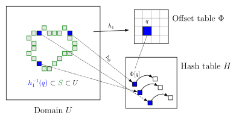

# Perfect Spatial Hashing


最近在工作中接触到了 Perfect Spatial Hashing (PSH) 算法，想法比较巧妙，也很实用，故在此记录。论文地址: [https://hhoppe.com/perfecthash.pdf](https://hhoppe.com/perfecthash.pdf). [本地存档](./perfecthash.pdf).

在3D图形领域经常需要计算 voxel 数据，例如 irradiance cache 等，这些数据依附于物体表面，而在空间中的其他位置没有值，因此是十分稀疏的。如何高效存储稀疏体素数据是一个具有挑战的问题。比较容易想到以下几种方法。

- 3D dense grid。 访问速度很快，但是空间占用巨大，并且浪费严重。
- octree。 访问速度 log 级别，需要多次读取 buffer/texture 并根据实际结果进行分支跳转，对cache不友好。
- naive hash。平均 $O(1)$ 访问时间，但是遇到 hash 冲突会影响并行效率，最坏情况不可控。 

PSH 则是在标准 hash 的基础上进行改进，在预处理阶段提前解决冲突，从而保证运行时无冲突，达到常数级的访问速度。

#### 原理

Perfect Hash 听起来有点不可思议，但背后的思想很简单：如果一次哈希会冲突，那就将它调整到一个不会冲突的位置上去。

在实现上，PSH 用了两个表，一个 hash table $H$ 存具体的数据内容，一个 offset table $\Phi$ 用来处理冲突；并有两个 hash 函数 $h_0$ 和 $h_1$，参数对应上述两个数据表的大小。

<div>
<center>

</center>
</div>

假设要找到一个点 $p$ 对应的数据项，先用 $h_1$ 计算其在 offset 表中的index， $q=h_1(p)$。 通过查询 offset 表，得到一个偏移值 $\Phi[q]$。可能同事有多个体素被映射到同一个桶里，如上图左边蓝色体素都被映射到了 $q$ 上。

另一方面，$h_0$ 将体素位置映射到 hash table 的位置 $h_0(p)$。
那么 $p$ 点对应的数据项就是 $H[h_0(p) + \Phi[q]]$。

一般而言，如果两个体素经过 $h_0$ 被映射到同一个位置，则它们经过 $h_1$ 就不应该映射到同一个位置。 即 $h_0(p_1) = h_0(p_2) \Rightarrow h_1(p_1) \neq h_1(p_2)$ 。如果这个条件不能满足，就需要更换 offset table 和 hash table 的大小，也就相当于更换了 $h_0$ 和 $h_1$ 两个函数。 

#### 构造算法

如何知道 $\Phi$ 里面每一项的数值是多少呢？其实很难一下子知道，需要通过不断地试不同的值给试出来。
假设所有的非空体素的个数为 $N$，将它们离散化成正整数坐标。

1. 初始化

创建一个大小为 $M$ 的数据表 $H$ 和 一个大小为 $S$ 的偏移表 $\Phi$，满足 $M$ 和 $S$ 是素数，且 $M > N$。两个表初始数据都为空。

2. 分组和排序

遍历所有的体素，计算 $q=h_1(p)$，按 $q$ 值将体素分组。同一个桶里的点，在运行时会查到同一个偏移量。因此，我们必须为这个桶找到一个公用的偏移量，使得桶里所有点经过偏移之后都不会在 $H$ 中发生碰撞。

直观来看，当一个桶内只有一个点的时候，只要 $H$ 里还有空位，就总能找到一个偏移量；而桶内的点越多，找到可用的偏移量就越难，这要求空位的间隔满足一定的约束条件。所以这一步按桶内点的数量从大到小排序，在空位多的时候先处理最难办的那些桶。

3. 搜索

遍历每个桶 $q_i$，并尝试所有可能的偏移值 $\phi_i = \Phi[q_i] = 0,1,2,\cdots$，并测试桶内每个点 $p_j\in h_1^{-1}(q_i)$，是否都满足 $H[h_0(p_j)+\phi_i]$ 为空。试出一个 $\phi_i$ 后，将 $H$ 中的这些位置标记为已占用，继续遍历下一个桶。
若找到一组 $\lbrace \phi_i \rbrace$ 对所有的 $i,j$ 都测试通过，则找到了一个解，结束。否则需要更换 $H$ 和 $\Phi$ 的大小，回到第1步重试。

#### 分析

运行时使用 PSH 的 shader 伪代码如下：
``` cpp
static const int d=2; // spatial dimensions (2 or 3)
typedef vector<float,d> point;
#define tex(s,p) (d==2 ? tex2D(s,p) : tex3D(s,p))

sampler SOffset, SHData; // tables phi and H.
matrix<float,d,d> M[2]; // M0, M1 prescaled by 1/m , 1/r.

point ComputeHash(point p) { // evaluates h(p) -> [0,1]^d
    point h0 = mul(M[0],p); 
    point h1 = mul(M[1],p);
    point offset = tex(SOffset, h1) * oscale;
    return h0 + offset;
}
float4 HashedTexture(point pf) : COLOR {
    // pf is prescaled into range [0,u] of space U
    point h = ComputeHash(floor(pf));
    return tex(SHData, h);
}
```

可以看出其中没有分支逻辑，保证了所有线程执行的代码路径完全一致。在实际使用时，offset 表的大小通常都比较小，因此对缓存也是比较友好的。

PSH 缺点之一是构造很耗时，这意味着它只适用于静态的大规模稀疏场景。 另一个缺点是无法知道某个体素是否合法，因为查询算法总能为空间中的每个体素都返回一个 $H$ 的数据。显然会有冲突。PSH 只能保证合法的体素之间相互无冲突，而几乎不会知道一个体素是不是合法的。
